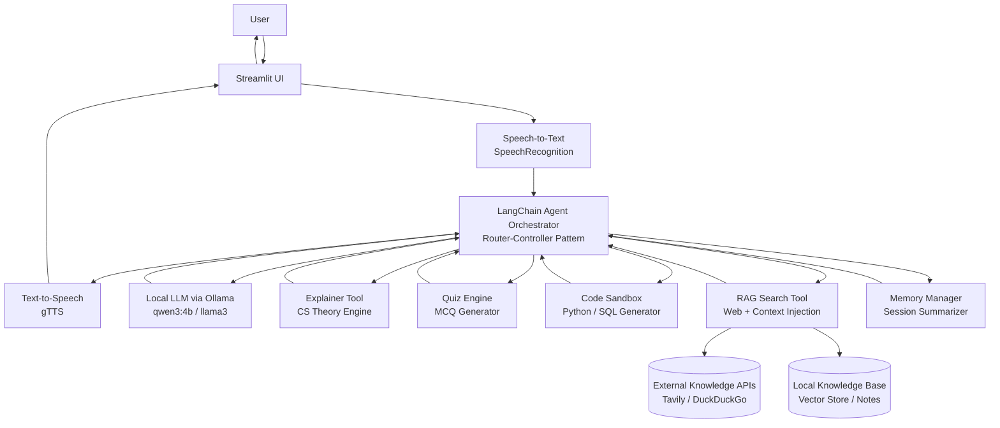

# 🧠 StudyBuddy: Agentic Voice-Orchestrator for CS

[](https://www.python.org/)
[](https://ollama.com/)
[](https://langchain.com/)
[](https://streamlit.io/)

StudyBuddy is a high-performance **Agentic AI Assistant** designed for deep-focus Computer Science learning. By combining local LLMs with a multi-tool RAG architecture, it provides a privacy-first, voice-interactive tutor for **DBMS, OS, CN, and SQL**.

---

## 🏛️ Architecture & Logic Flow

StudyBuddy utilizes a **Router-Controller Pattern**. The LLM (Qwen3) serves as the "brain," dynamically selecting tools based on conversational intent.

---

## 🧩 System Architecture Diagram



---

### System Workflow

1. **Ingestion:** Real-time audio capture via `SpeechRecognition`.
2. **Orchestration:** `LangChain` agent parses intent and dispatches to specialized Python modules.
3. **Augmentation:** Fetches real-time data via **RAG** (Retrieval-Augmented Generation) or local vector stores.
4. **Synthesis:** Outputs structured text/code and converts to audio via `gTTS`.

---

## 🔄 Detailed Execution Flow

### 1️⃣ Perception Layer

* Audio input captured using `SpeechRecognition`
* Noise filtering and preprocessing applied
* Text query forwarded to the agent controller

### 2️⃣ Reasoning Layer

* `qwen3:4b` running via Ollama interprets user intent
* LangChain Agent performs functional tool-calling
* Router selects appropriate specialized module

### 3️⃣ Tool Execution Layer

Depending on intent, the system may:

* Generate deep theoretical explanations (DBMS, OS, CN)
* Create Bloom’s Taxonomy-based MCQs
* Produce optimized SQL/Python snippets
* Trigger RAG-based academic search
* Update session memory summary

### 4️⃣ Response Synthesis Layer

* Structured text returned to orchestrator
* Converted to natural speech using `gTTS`
* Rendered inside Streamlit interface

---

## 🛠️ Tech Stack

| Layer            | Technology              | Role                                    |
| :--------------- | :---------------------- | :-------------------------------------- |
| **Brain**        | `Ollama` / `qwen3:4b`   | Local Reasoning & Intent Classification |
| **Orchestrator** | `LangChain`             | Agent Tool-Calling & Tool Routing       |
| **Interface**    | `Streamlit`             | Reactive Web Dashboard                  |
| **Audio**        | `gTTS` & `PyAudio`      | Seamless STT/TTS Loop                   |
| **Search**       | `Tavily` / `DuckDuckGo` | Real-time Academic RAG                  |

---

## ✨ Features

* **🎙️ Hands-Free Learning:** Low-latency voice-to-voice interaction.
* **🧩 Tool-Augmented reasoning:** Dynamically generates **MCQs**, **SQL snippets**, and **Mermaid.js** diagrams.
* **💾 Memory Persistence:** Tracks learning progress to generate a "Daily Knowledge Delta."
* **🔒 Local-First:** No data leakage—inference runs entirely on your hardware via Ollama.

---

## 📂 Engineering Structure

```bash
studybuddy/
├── 📁 agents/           # LangChain Logic (Router/Prompts)
├── 📁 tools/            # Specialized Engines (Quiz, Code, RAG, Memory)
├── 📁 assets/           # Dynamic Visualizations & Diagrams
├── 📄 app.py            # Streamlit Reactive UI & Voice Loop
└── 📄 requirements.txt  # Environment Manifest
```

---

## 🚀 Deployment Overview

### Environment Setup

```bash
python -m venv venv
source venv/bin/activate   # Windows: venv\Scripts\activate
pip install -r requirements.txt
```

### Initialize Local LLM

```bash
ollama serve
ollama pull qwen3:4b
```

### Launch Application

```bash
streamlit run app.py
```

---

## 📌 Architectural Highlights

* **Agentic Router-Controller Pattern**
* **Multi-Tool Execution Graph**
* **Hybrid RAG (Web + Local Vector Store)**
* **Session-Aware Learning Memory**
* **Privacy-First Local Inference**

---

**StudyBuddy — Engineering Agentic Intelligence for Computer Science Education.**
